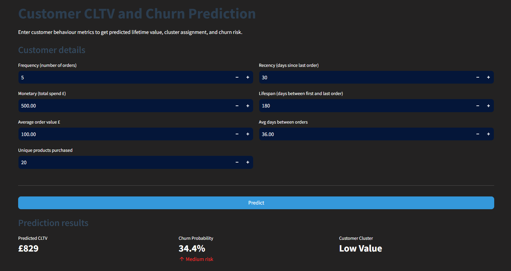
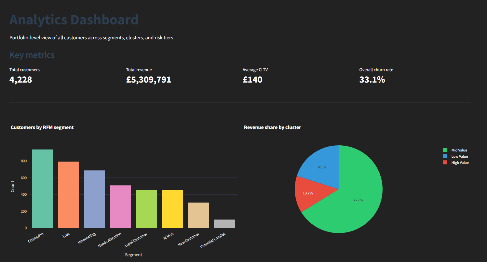
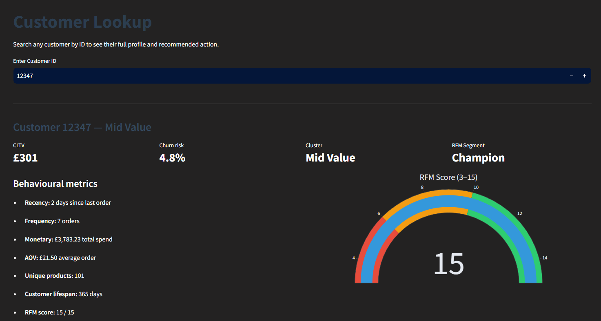
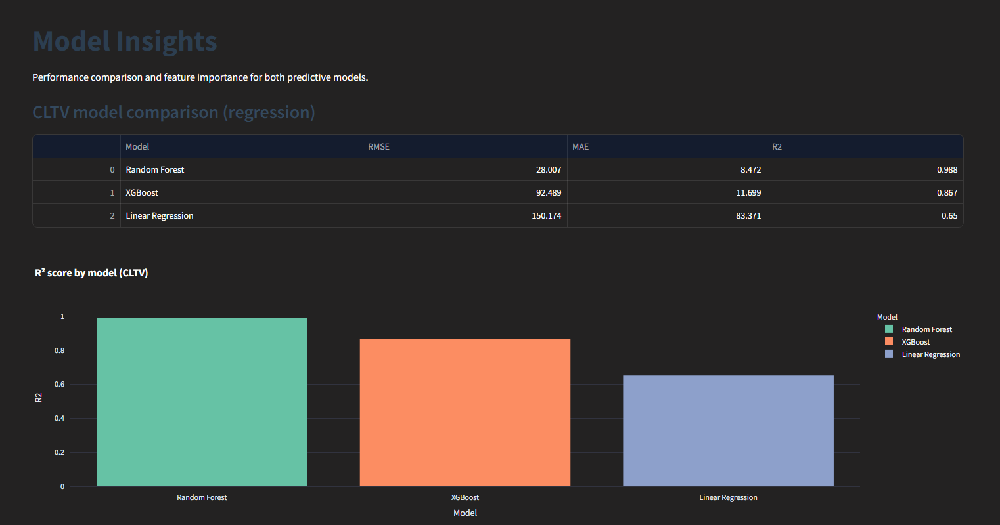

# 📊 Customer Lifetime Value Prediction & Customer Analytics Dashboard

An end-to-end Machine Learning project that predicts **Customer Lifetime Value (CLTV)**, **customer churn**, and **customer segments** from transactional retail data, with an interactive Streamlit dashboard for business insights.

---

## 🚀 Live Demo

🌐 **Live Application:** <https://customer-lifetime-value-ctj2.onrender.com/>

> **Note:** This application is hosted on Render's free tier. If the app has been idle, the first request may take 30–60 seconds while the server wakes up.

📂 **GitHub Repository:** <https://github.com/sadhika-tech/Customer-Lifetime-Value>

---

## 📌 Project Overview

Businesses lose significant revenue by treating every customer the same. This project helps identify:

- 💰 High-value customers
- ⚠️ Customers likely to churn
- 🎯 Customer segments for targeted marketing
- 📈 Revenue opportunities through customer analytics

The project follows a complete data science workflow from raw transactional data to deployment.

---

## ✨ Features

- Predict Customer Lifetime Value (CLTV)
- Predict customer churn probability
- RFM segmentation
- Customer clustering using PCA + K-Means
- SHAP explainability for model predictions
- Interactive multi-page Streamlit dashboard
- Customer lookup by Customer ID
- Business KPI dashboard

---

# 📊 Dataset

**Dataset:** UCI Online Retail Dataset

https://archive.ics.uci.edu/ml/datasets/online+retail

The dataset is not included in this repository due to size constraints.

Download the **Online Retail Dataset** from the UCI Machine Learning Repository and place it in the project root as:

Online Retail.xlsx

### Dataset Summary

| Item | Value |
|------|-------|
| Transactions | 541,909 |
| Customers | ~4,300 |
| Countries | 38 |
| Period | Dec 2010 – Dec 2011 |
| Features | 8 |

---

# 🛠 Tech Stack

### Programming

- Python

### Data Processing

- Pandas
- NumPy
- OpenPyXL

### Machine Learning

- Scikit-Learn
- XGBoost

### Explainable AI

- SHAP

### Visualization

- Matplotlib
- Seaborn
- Plotly
- Squarify

### Deployment

- Streamlit

---

# 🏗 Project Workflow

```
Raw Dataset
      │
      ▼
Exploratory Data Analysis
      │
      ▼
Data Cleaning
      │
      ▼
Feature Engineering
      │
      ▼
RFM Segmentation
      │
      ▼
CLTV Prediction
      │
      ▼
Churn Prediction
      │
      ▼
SHAP Explainability
      │
      ▼
Customer Clustering
      │
      ▼
Business Insights
      │
      ▼
Interactive Dashboard
```

---

# 🤖 Machine Learning Models

## CLTV Prediction

| Model | RMSE | MAE | R² |
|------|------|------|------|
| Random Forest ✅ | 28.007 | 8.472 | 0.988 |
| XGBoost | 92.489 | 11.699 | 0.867 |
| Linear Regression | 150.174 | 83.371 | 0.65 |

**Selected Model:** Random Forest

Reason:
- Lowest RMSE
- Highest R²
- Best overall generalization

---

## Churn Prediction

| Model | Accuracy | Precision | Recall | F1 Score | ROC-AUC |
|------|------|------|------|------|------|
| XGBoost ✅ | 0.7317 | 0.6118 | 0.5179 | 0.5609 | 0.8081 |
| Random Forest | 0.7116 | 0.5726 | 0.5071 | 0.5379 | 0.7983 |
| Logistic Regression | 0.7246 | 0.5719 | 0.6679 | 0.6161 | 0.7935 |

**Selected Model:** XGBoost

---

# 📈 Dashboard Pages

## 🔮 Predict

- Predict CLTV
- Predict churn probability
- Customer segment
- Recommended business action

---

## 📊 Analytics

- Revenue KPIs
- Segment distribution
- Cluster insights
- Revenue analysis

---

## 👤 Customer Lookup

Search any customer and view:

- Customer profile
- CLTV
- Churn probability
- Segment
- Cluster

---

## 🧠 Model Insights

- Feature importance
- SHAP explanations
- Model comparison
- Explainability plots

---

# 📁 Project Structure

```
customer-lifetime-value/
│
├── .streamlit/
├── app/                        
├── models/                      
├── notebooks/                  
├── outputs/               
├── requirements.txt            
├── runtime.txt                 
├── Procfile          
├── .gitignore
└── README.md
```
---

# 📷 Screenshots

## Prediction Page



---

## Analytics Dashboard



---

## Customer Lookup



---

## Model Insights



---

# 💡 Key Design Decisions

### Why Random Forest for CLTV?

Random Forest achieved the lowest prediction error and highest R² score after extensive model comparison and hyperparameter tuning.

---

### Why XGBoost for Churn?

XGBoost provided the highest classification performance while maintaining strong generalization on unseen customers.

---

### Why remove Recency from churn features?

Since churn was defined using a Recency threshold, including it as a feature would introduce target leakage and artificially inflate model performance.

---

### Why SHAP?

SHAP provides local and global explanations, enabling transparent interpretation of model predictions for business users.

---

# 📦 Installation

Clone the repository

```bash
git clone https://github.com/sadhika-tech/Customer-Lifetime-Value
```

Move into the project

```bash
cd Customer-lifetime-value
```

Create virtual environment

```bash
python -m venv venv
```

Activate

Windows

```bash
venv\Scripts\activate
```

Linux / Mac

```bash
source venv/bin/activate
```

Install dependencies

```bash
pip install -r requirements.txt
```

Run

```bash
streamlit run app/app.py
```

---

# 🎯 Future Improvements

- Customer recommendation engine
- Real-time prediction API
- Automated retraining pipeline
- Time-series forecasting
- Cloud database integration
- User authentication

---
